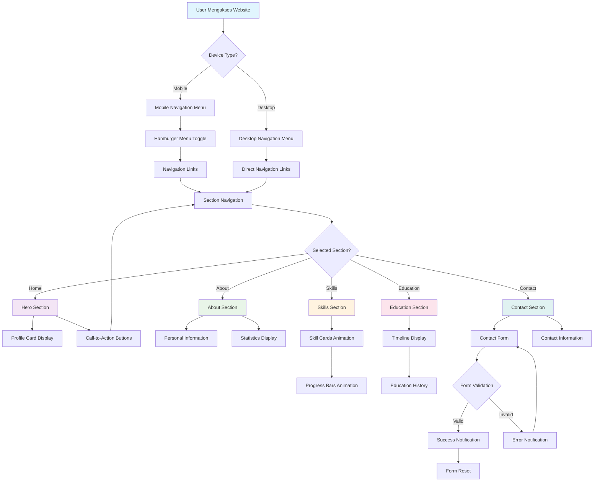
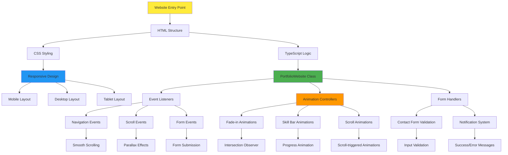
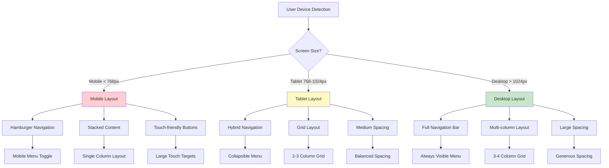
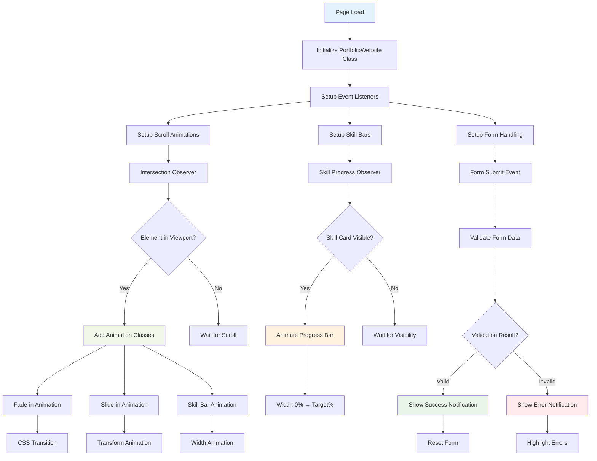
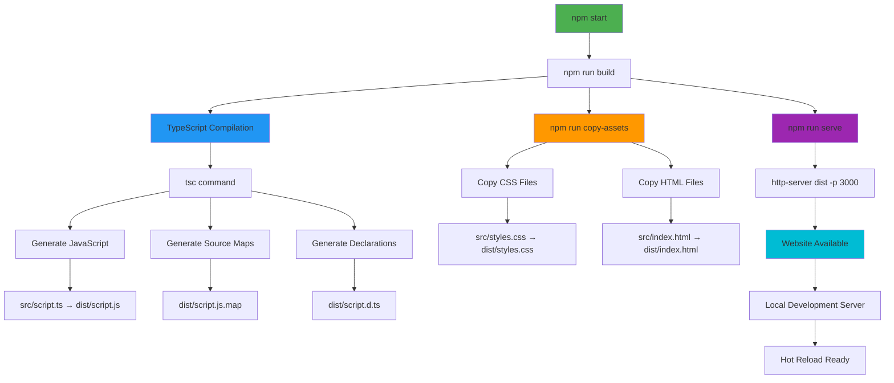

# Flowchart Website Portofolio Dimas Bayu

## 🎯 User Journey Flowchart



## 🏗️ Website Architecture Flowchart



## 📱 Responsive Design Flowchart



## 🎨 Animation Flowchart



## 🔄 Build Process Flowchart



## 📊 Content Structure Flowchart

```mermaid
flowchart TD
    A[Website Content] --> B[Hero Section]
    A --> C[About Section]
    A --> D[Skills Section]
    A --> E[Education Section]
    A --> F[Contact Section]
    
    B --> G[Personal Introduction]
    B --> H[Profile Card]
    B --> I[Call-to-Action Buttons]
    
    C --> J[Personal Description]
    C --> K[Statistics Cards]
    C --> L[Profile Image Placeholder]
    
    D --> M[Technical Skills]
    D --> N[Marketing Skills]
    D --> O[Programming Skills]
    D --> P[Communication Skills]
    
    E --> Q[SMK Negeri 1 Liwa]
    E --> R[Self Development]
    E --> S[Timeline Visualization]
    
    F --> T[Contact Form]
    F --> U[Contact Information]
    F --> V[Social Media Links]
    
    M --> W[Network Configuration]
    N --> X[Digital Marketing]
    O --> Y[HTML/CSS/JavaScript]
    P --> Z[Presentation Skills]
    
    Q --> AA[Computer Network Engineering]
    R --> BB[Marketing & Sales]
    
    T --> CC[Name, Email, Subject, Message]
    U --> DD[Email, Phone, Location]
    V --> EE[LinkedIn, GitHub, Instagram]
    
    style B fill:#e1f5fe
    style C fill:#f3e5f5
    style D fill:#e8f5e8
    style E fill:#fff3e0
    style F fill:#fce4ec
```



## 🚀 Deployment Flowchart

```mermaid
flowchart TD
    A[Development Complete] --> B[Git Operations]
    B --> C[git add .]
    C --> D[git commit -m "message"]
    D --> E[git push origin main]
    
    E --> F[GitHub Repository]
    F --> G[Enable GitHub Pages]
    G --> H[Repository Settings]
    H --> I[Pages Section]
    I --> J[Deploy from Branch]
    J --> K[Select Main Branch]
    K --> L[Select Root Folder]
    L --> M[Save Configuration]
    
    M --> N[GitHub Pages Build]
    N --> O[Website Deployment]
    O --> P[Live Website]
    
    P --> Q[https://dimasliwa628-afk.github.io/Dimasporto/]
    
    Q --> R[Public Access]
    R --> S[Portfolio Showcase]
    S --> T[Professional Presentation]
    
    style A fill:#4caf50
    style F fill:#2196f3
    style P fill:#ff9800
    style Q fill:#9c27b0
    style T fill:#00bcd4
```

---

## 📝 Flowchart Legend

- **🟦 Blue**: Entry Points & Navigation
- **🟩 Green**: Content & Information
- **🟨 Yellow**: Processes & Actions
- **🟪 Purple**: Technical Implementation
- **🟧 Orange**: Animations & Interactions
- **🟥 Red**: Error Handling
- **🟫 Brown**: Data & Validation

## 🎯 Key Features Highlighted

1. **Responsive Design** - Mobile-first approach
2. **Interactive Animations** - Scroll-triggered effects
3. **Form Validation** - Real-time feedback
4. **Smooth Navigation** - Seamless user experience
5. **Professional Presentation** - Clean, modern design
6. **GitHub Integration** - Easy deployment
7. **TypeScript Implementation** - Type-safe code
8. **Performance Optimized** - Fast loading times

